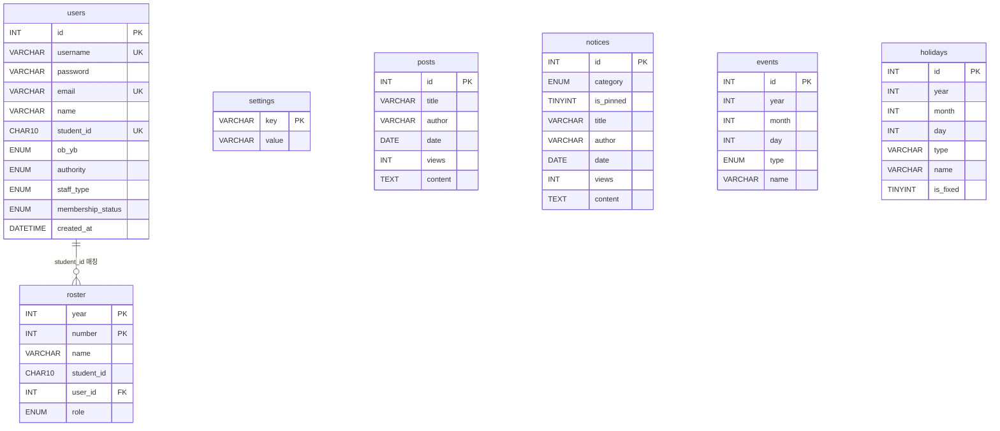

# KWU Pegasus — 서버 & 클라이언트

광운대학교 페가수스 아마야구 동아리 웹사이트입니다.

---

## 기술 스택

### 백엔드
- **Runtime** Node.js
- **Framework** Express 5
- **Database** MySQL 8 + mysql2
- **인증** JWT (jsonwebtoken) + bcrypt

### 프론트엔드
- **Framework** React 19 + Vite
- **라우팅** React Router v7
- **스타일** CSS Modules

---

## 권한 체계

계정 권한은 5단계로 구분됩니다. 상위 권한은 하위 권한을 모두 포함합니다.

| 권한 | 설명 | 헤더 표시 |
|------|------|-----------|
| `basic` | 최초 가입 시 부여. 읽기 전용 | 일반 |
| `member` | 관리자 승인 후 부여. 게시판 글쓰기 가능 | 멤버 |
| `manager` | staff/root가 임명. 공지·일정 관리 가능 | 매니저 |
| `staff` | 회장·감독. 멤버를 매니저로 임명 가능 | 회장 / 감독 |
| `root` | 최고 관리자. 모든 권한 변경 가능 | ROOT |

`staff`는 `staff_type`으로 세분화됩니다: `president`(회장) / `headcoach`(감독).
헤더 배지는 `staff`일 경우 `staff_type`을 우선 표시합니다.

### 기능별 권한

| 기능 | basic | member | manager | staff | root |
|------|:-----:|:------:|:-------:|:-----:|:----:|
| 공개 페이지 열람 | ✅ | ✅ | ✅ | ✅ | ✅ |
| 마이페이지 | ✅ | ✅ | ✅ | ✅ | ✅ |
| 멤버 신청 | ✅ | — | — | — | — |
| 로스터 이력 조회 | — | ✅ | ✅ | ✅ | ✅ |
| 게시판 글쓰기 | — | ✅ | ✅ | ✅ | ✅ |
| 공지사항 글쓰기 | — | — | ✅ | ✅ | ✅ |
| 관리자 페이지 | — | — | ✅ | ✅ | ✅ |
| 멤버 신청 승인·거부 | — | — | ✅ | ✅ | ✅ |
| 로스터 CRUD | — | — | ✅ | ✅ | ✅ |
| 매니저 임명 | — | — | — | ✅ | ✅ |
| 전체 권한 변경 | — | — | — | — | ✅ |
| 회원 목록 조회 | — | — | — | — | ✅ |

### 멤버 신청 플로우

```
가입 (basic)
  → 마이페이지에서 실명·학번·OB/YB 입력 후 신청 (pending)
    → manager 이상 승인 → member 권한 부여
    → manager 이상 거부 → rejected
```

---

## DB 구조



### 주요 컬럼 설명

**`users.authority`** `basic | member | manager | staff | root`
**`users.staff_type`** `president | headcoach` — authority가 staff일 때만 사용
**`users.membership_status`** `none | pending | approved | rejected`

**`roster.role`** `player | headcoach | president | retired`
— 유저 권한(`authority`)과 별개로 관리되는 로스터 내 역할

**`settings`** 키-값 전역 설정. 현재 사용: `active_roster_year`

**`holidays.is_fixed`** `1`이면 매년 동일 날짜(삼일절 등), `0`이면 음력 기준 공휴일(설날·추석 등)

---

## 서버 구조

```
KWU-Pegasus-server/
├── server.js                   진입점 (포트 바인딩)
├── sql/
│   ├── schema.sql              DB 전체 테이블 정의 (DDL)
│   ├── seed.sql                전체 시드 데이터 (DML)
│   └── seeds/                  연도별 참조용 시드 파일
│       ├── roster/
│       │   ├── roster_2025.sql
│       │   └── roster_2026.sql
│       ├── events/
│       └── holidays/
└── src/
    ├── app.js                  Express 앱 설정 (CORS, 라우터, 에러 핸들러)
    ├── db.js                   MySQL 커넥션 풀
    ├── middlewares/
    │   └── auth.js             JWT 인증 미들웨어 (authenticate, requireRole)
    ├── controllers/
    │   ├── authController.js       회원가입 / 로그인 / 내 정보
    │   ├── mypageController.js     마이페이지 (프로필, 멤버 신청, 로스터 이력)
    │   ├── adminController.js      관리자 (멤버 승인, 로스터 CRUD, 권한 변경, 매니저 임명)
    │   ├── rosterController.js     선수단 공개 조회
    │   ├── postsController.js      게시판 CRUD
    │   ├── noticesController.js    공지사항 CRUD
    │   ├── eventsController.js     팀 일정 조회·추가·삭제
    │   └── holidaysController.js   공휴일 조회
    └── routes/
        ├── auth.js
        ├── mypage.js
        ├── admin.js
        ├── roster.js
        ├── posts.js
        ├── notices.js
        ├── events.js
        └── holidays.js
```

---

## API 명세

### 인증 `/api/auth`

| 메서드 | 경로 | 설명 | 권한 |
|--------|------|------|------|
| POST | `/signup` | 회원가입 | — |
| POST | `/login` | 로그인 (JWT 반환) | — |
| GET | `/me` | 내 정보 조회 | 로그인 |

### 마이페이지 `/api/mypage`

| 메서드 | 경로 | 설명 | 권한 |
|--------|------|------|------|
| GET | `/me` | 내 상세 정보 | 로그인 |
| PUT | `/profile` | 프로필 수정 (실명·학번·OB/YB) | 로그인 |
| POST | `/membership-request` | 멤버 신청 | 로그인 |
| GET | `/roster-history` | 내 로스터 이력 | 로그인 |

### 관리자 `/api/admin`

| 메서드 | 경로 | 설명 | 권한 |
|--------|------|------|------|
| GET | `/pending-members` | 신청 대기 목록 | manager+ |
| POST | `/approve-member/:id` | 멤버 신청 승인 → member 권한 부여 | manager+ |
| POST | `/reject-member/:id` | 멤버 신청 거부 | manager+ |
| GET | `/roster?year=` | 로스터 조회 (admin용) | manager+ |
| POST | `/roster` | 로스터 항목 추가 | manager+ |
| PUT | `/roster/:year/:number` | 로스터 항목 수정 | manager+ |
| DELETE | `/roster/:year/:number` | 로스터 항목 삭제 | manager+ |
| PUT | `/roster-year` | 활성 로스터 연도 변경 | manager+ |
| GET | `/members` | member 목록 (매니저 임명용) | staff+ |
| PUT | `/users/:id/set-manager` | member → manager 임명 | staff+ |
| GET | `/users` | 전체 회원 목록 | root |
| PUT | `/users/:id/role` | 권한 변경 | root |

### 선수단 `/api/roster`

| 메서드 | 경로 | 설명 |
|--------|------|------|
| GET | `/?year=` | 연도별 선수단 조회 (생략 시 활성 연도) |
| GET | `/years` | 등록된 연도 목록 |
| GET | `/active-year` | 현재 활성 연도 |

### 게시판 `/api/posts`

| 메서드 | 경로 | 설명 | 권한 |
|--------|------|------|------|
| GET | `/` | 목록 | — |
| GET | `/:id` | 상세 (조회수 +1) | — |
| POST | `/` | 작성 | member+ |
| PUT | `/:id` | 수정 | member+ |
| DELETE | `/:id` | 삭제 | member+ |

### 공지사항 `/api/notices`

| 메서드 | 경로 | 설명 | 권한 |
|--------|------|------|------|
| GET | `/` | 목록 (고정글 상단) | — |
| GET | `/:id` | 상세 (조회수 +1) | — |
| POST | `/` | 작성 | manager+ |
| PUT | `/:id` | 수정 | manager+ |
| DELETE | `/:id` | 삭제 | manager+ |

### 팀 일정 `/api/events`

| 메서드 | 경로 | 설명 | 권한 |
|--------|------|------|------|
| GET | `/?year=` | 연도별 일정 | — |
| POST | `/` | 추가 | manager+ |
| DELETE | `/:id` | 삭제 | manager+ |

### 공휴일 `/api/holidays`

| 메서드 | 경로 | 설명 |
|--------|------|------|
| GET | `/?year=` | 연도별 공휴일 |

---

## 프론트엔드 구조

```
KWU-Pegasus/src/
├── main.jsx                        진입점
├── App.jsx                         라우터 정의 + ProtectedRoute
├── index.css                       전역 CSS 변수 (디자인 토큰)
├── context/
│   └── AuthContext.jsx             로그인 상태 전역 관리 (JWT 디코딩·저장)
├── layouts/
│   └── Header.jsx                  상단 네비게이션 바
├── lib/
│   ├── api.js                      API_BASE URL 상수
│   └── constants.js                공통 레이블·타입 상수
├── components/
│   └── Pagination.jsx              페이지네이션 공통 컴포넌트
└── pages/
    ├── Home.jsx                    홈
    ├── Schedule.jsx                팀 일정 캘린더
    ├── Roster.jsx                  선수단 명단
    ├── MyPage.jsx                  마이페이지 (프로필·멤버 신청·로스터 이력)
    ├── Admin.jsx                   관리자 페이지
    ├── Unauthorized.jsx            권한 없음 안내
    ├── NotFound.jsx                404
    ├── auth/
    │   ├── Login.jsx
    │   └── Signup.jsx
    ├── board/
    │   ├── Board.jsx               게시판 목록
    │   ├── BoardDetail.jsx         게시글 상세
    │   └── BoardWrite.jsx          게시글 작성
    └── notice/
        ├── Notice.jsx              공지사항 목록
        ├── NoticeDetail.jsx        공지사항 상세
        └── NoticeWrite.jsx         공지사항 작성
```

### 라우트 보호 (`ProtectedRoute`)

```
/board/write        member 이상
/notice/write       manager 이상
/admin              manager 이상
/mypage             로그인 필요
```

미로그인 → `/login` 리다이렉트
권한 부족 → `/unauthorized` 리다이렉트

### 인증 흐름

1. 로그인 시 서버에서 JWT 반환
2. `remember me` 여부에 따라 `localStorage` 또는 `sessionStorage` 저장
3. `AuthContext`에서 토큰을 디코딩해 `user` 객체 전역 제공
4. API 요청 시 `Authorization: Bearer <token>` 헤더 첨부

### 디자인 토큰 (`index.css`)

| 변수 | 값 | 용도 |
|------|----|------|
| `--main-800` | `#011126` | 배경 (짙은 네이비) |
| `--main-500` | `#A6926D` | 주요 강조 (골드) |
| `--main-400` | `#C0AC87` | 중간 강조 |
| `--main-300` | `#D9C5A0` | 연한 강조 |
| `--text-100` | `#ffffff` | 기본 텍스트 |
| `--color-red` | `#f07070` | 일요일·공휴일·경고 |
| `--color-blue` | `#6fa3f5` | 토요일·감독·링크 |
