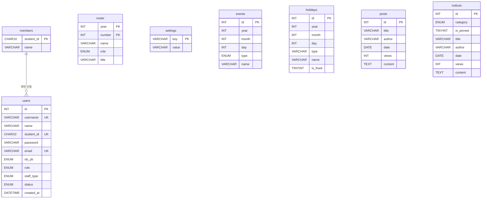

# KWU Pegasus — 백엔드 서버

광운대학교 페가수스 아마야구 동아리 웹사이트의 백엔드 서버입니다.

## 기술 스택

- **Runtime** Node.js
- **Framework** Express 5
- **Database** MySQL 8 + mysql2
- **인증** JWT (jsonwebtoken) + bcrypt
- **기타** dotenv, cors, nodemon

## 디렉토리 구조

```
KWU-Pegasus-server/
├── server.js               진입점
├── .env                    환경변수 (git 제외)
├── sql/
│   └── schema.sql          DB 전체 테이블 생성 + 시드 쿼리
└── src/
    ├── app.js              Express 앱 설정 (CORS, 라우터 등록, 에러 핸들러)
    ├── db.js               MySQL 커넥션 풀
    ├── controllers/
    │   ├── authController.js     회원가입 / 로그인 / 내 정보
    │   ├── adminController.js    관리자 (승인, 권한, 회원 명단, 로스터 연도)
    │   ├── rosterController.js   선수단 조회
    │   ├── postsController.js    게시판 CRUD
    │   ├── noticesController.js  공지사항 CRUD
    │   ├── eventsController.js   팀 일정 조회/추가/삭제
    │   └── holidaysController.js 공휴일 조회
    ├── routes/
    │   ├── auth.js
    │   ├── admin.js
    │   ├── roster.js
    │   ├── posts.js
    │   ├── notices.js
    │   ├── events.js
    │   └── holidays.js
    └── middlewares/
        └── auth.js         JWT 인증 / 권한 미들웨어 (authenticate, requireRole)
```

## 시작하기

### 1. 패키지 설치
```bash
npm install
```

### 2. 환경변수 설정

`.env` 파일을 생성하고 아래 내용을 입력합니다:

```env
PORT=3001
DB_HOST=localhost
DB_USER=root
DB_PASSWORD=비밀번호
DB_NAME=kwu_pegasus
JWT_SECRET=임의의_시크릿_키
CORS_ORIGIN=http://localhost:5173
```

### 3. DB 세팅

MySQL Workbench에서 `sql/schema.sql` 을 실행합니다.
테이블 생성과 기본 시드 데이터(공휴일 등)가 함께 적용됩니다.

### 4. 서버 실행

```bash
# 개발
npm run dev

# 프로덕션
npm start
```

서버는 기본적으로 `http://localhost:3001` 에서 실행됩니다.

---

## API 명세

### 인증 `/api/auth`

| 메서드 | 경로 | 설명 | 인증 |
|--------|------|------|------|
| POST | `/signup` | 회원가입 신청 | - |
| POST | `/login` | 로그인 (JWT 반환) | - |
| GET | `/me` | 내 정보 조회 | 필요 |

**POST /signup**
```json
{
  "username": "아이디",
  "password": "비밀번호",
  "email": "example@email.com",
  "name": "홍길동",
  "ob_yb": "yb",
  "student_id": "2021000000"
}
```
> `student_id` 입력 시 `members` 테이블의 학번+이름과 대조하여 일치하면 `role=player` 자동 부여.

**POST /login**
```json
{ "username": "아이디", "password": "비밀번호" }
```
```json
// 응답
{ "token": "JWT토큰", "user": { "id": 1, "username": "아이디", "role": "player", ... } }
```

---

### 관리자 `/api/admin`

모든 엔드포인트는 `staff` 또는 `root` 권한 필요.

| 메서드 | 경로 | 설명 |
|--------|------|------|
| GET | `/pending` | 승인 대기 회원 목록 |
| POST | `/approve/:id` | 회원가입 승인 |
| POST | `/reject/:id` | 회원가입 거부 |
| GET | `/users` | 전체 유저 목록 |
| PUT | `/users/:id/role` | 권한 변경 |
| GET | `/members` | 회원 명단 조회 |
| POST | `/members` | 회원 명단 추가 |
| DELETE | `/members/:student_id` | 회원 명단 삭제 |
| PUT | `/roster-year` | 활성 로스터 연도 변경 |

**PUT /users/:id/role**
```json
{ "role": "manager" }
// staff 지정 시 (root만 가능)
{ "role": "staff", "staff_type": "president" }
// staff_type: "president"(회장) | "coach"(감독)
```

---

### 선수단 `/api/roster`

| 메서드 | 경로 | 설명 |
|--------|------|------|
| GET | `/` | 선수단 조회 (쿼리: `?year=2026`, 생략 시 활성 연도) |
| GET | `/years` | 등록된 연도 목록 |
| GET | `/active-year` | 현재 활성 연도 |

---

### 게시판 `/api/posts`

| 메서드 | 경로 | 설명 | 인증 |
|--------|------|------|------|
| GET | `/` | 전체 게시글 목록 | - |
| GET | `/:id` | 게시글 상세 (조회수 +1) | - |
| POST | `/` | 게시글 작성 | player 이상 |
| PUT | `/:id` | 게시글 수정 | player 이상 |
| DELETE | `/:id` | 게시글 삭제 | player 이상 |

---

### 공지사항 `/api/notices`

| 메서드 | 경로 | 설명 | 인증 |
|--------|------|------|------|
| GET | `/` | 전체 공지사항 (고정글 상단) | - |
| GET | `/:id` | 공지사항 상세 (조회수 +1) | - |
| POST | `/` | 공지사항 작성 | manager 이상 |
| PUT | `/:id` | 공지사항 수정 | manager 이상 |
| DELETE | `/:id` | 공지사항 삭제 | manager 이상 |

---

### 팀 일정 `/api/events`

| 메서드 | 경로 | 설명 | 인증 |
|--------|------|------|------|
| GET | `/?year=2026` | 연도별 일정 조회 | - |
| POST | `/` | 일정 추가 | manager 이상 |
| DELETE | `/:id` | 일정 삭제 | manager 이상 |

---

### 공휴일 `/api/holidays`

| 메서드 | 경로 | 설명 |
|--------|------|------|
| GET | `/?year=2026` | 연도별 공휴일 조회 |

---

## 권한 체계

```
root    최고 관리자. staff 지정 가능.
staff   회장(president) 또는 감독(coach). 회원가입 승인, manager 지정 가능.
manager 공지사항 작성, 일정 관리 등 일반 관리 권한.
player  선수. 게시판 글쓰기 가능. 학번 인증으로 자동 부여.
user    일반 회원. ob(졸업생) / yb(재학생) 구분.
```

### 회원가입 플로우

```
신청 (pending) → staff 승인 → 활성화 (active)
              → staff 거부 → 거부됨 (rejected)
```

학번+이름 입력 시 members 테이블과 대조 → 일치하면 승인 후 player 권한 자동 부여.

---

## 인증 방식

요청 헤더에 JWT 토큰을 포함합니다:

```
Authorization: Bearer <token>
```

---

## DB 구조


